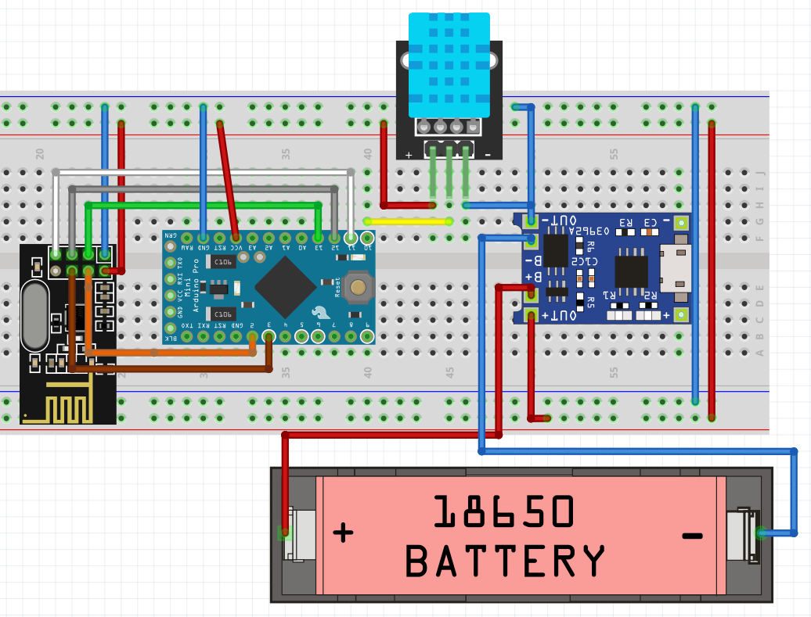
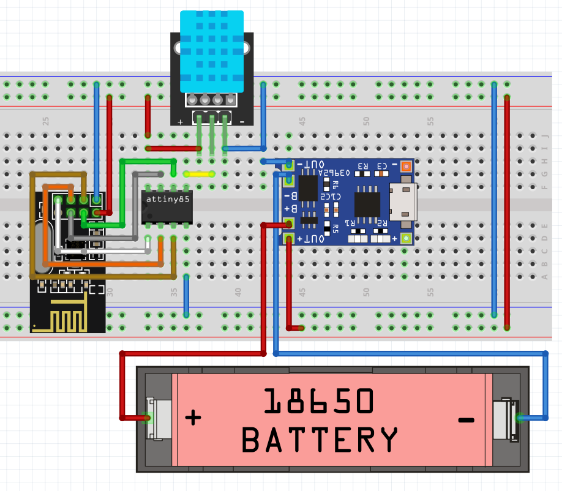
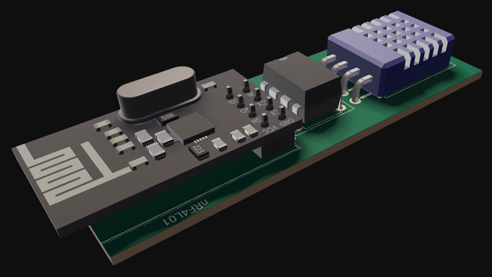
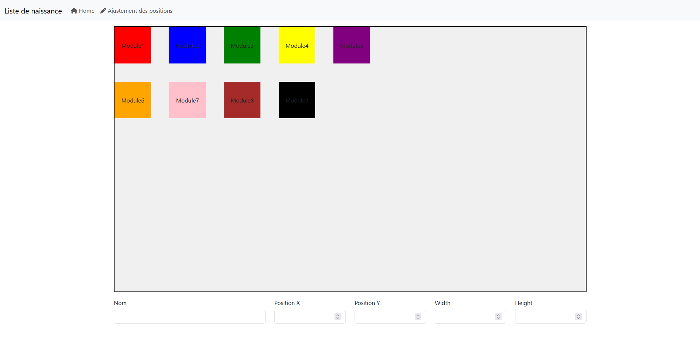
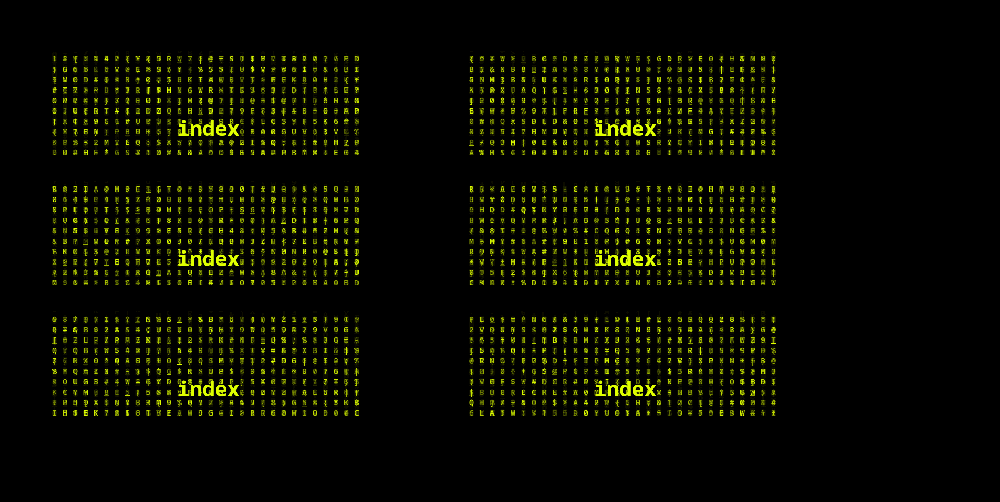
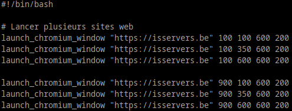
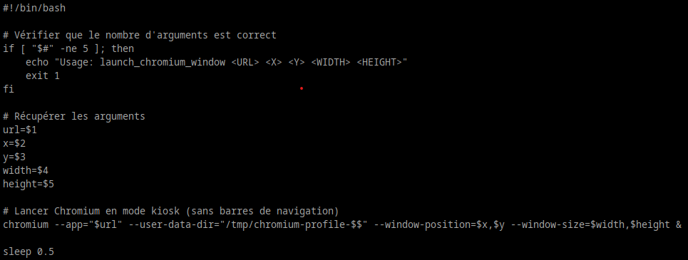

# Projet de Miroir Connecté et Domotique

## Contexte
Ce projet vise à développer un système domotique intégré avec un miroir connecté. Il combine la collecte et l'affichage des données environnementales comme la température, l'humidité, et la pression, tout en intégrant des fonctionnalités supplémentaires pour améliorer le confort et l'efficacité énergétique. 🌡️💡🛠️

---

## Objectifs

### Fonctionnalités principales
1. **Collecte des données** :
   - Mesurer la température, l'humidité, et la pression ambiante.
   - Ajouter des capteurs supplémentaires, tels que des détecteurs de fumée et de monoxyde de carbone.

2. **Transmission et stockage** :
   - Envoyer les données via des modules radio nrf24l01 connectés au Raspberry Pi.
   - Utiliser une base de données **InfluxDB** pour centraliser et stocker les informations.

3. **Affichage des données** :
   - Présenter les données collectées sur un miroir connecté sous forme d'une interface web via Chromium.
   - Intégrer des fenêtres sans bordure gérées par **OpenBox** sur un OS léger tel qu'Alpine Linux.

4. **Gestion de l'énergie** :
   - Alimenter les capteurs par des batteries rechargeables 18650 avec une autonomie visée de 9 mois.
   - Superviser l'autonomie via le suivi de la tension des batteries. 🔋📊✨

### Bénéfices attendus
- **Technologies démontrées** : mise en avant des compétences en développement et gestion de projet.
- **Usage pratique** : création d'un outil fonctionnel pour la gestion environnementale d'une maison.
- **Amélioration future** : intégration possible de vannes connectées pour contrôler le chauffage. 🚀🏠🌟

---

## Détails Techniques

### Architecture du système
1. **Capteurs** :
   - Capteurs DHT11 pour mesurer température, humidité, et pression.
   - Alimentation via batteries USB-C.

2. **Communication** :
   - Transmission radio par modules **nrf24l01**.

3. **Affichage et interface utilisateur** :
   - Écran intégré dans un miroir connecté.
   - Interface réalisée en **C#** pour la gestion des données.

4. **Système d'exploitation** :
   - Utilisation d'Alpine Linux pour un fonctionnement allégé.
   - Gestionnaire de fenêtres **OpenBox** avec fenêtres Chromium sans bordure. 💻📡📱

### Format des données transmises
Les données envoyées par les capteurs suivent un format standardisé :
```
A1:16.7:45:3.76
```
- `A1` : Identifiant de l'appareil.
- `16.7` : Température en °C.
- `45` : Humidité en %.
- `3.76` : Tension restante dans la batterie.

---

## Améliorations Futures
- **Ajout de capteurs supplémentaires** : détecteurs de fumée, monoxyde de carbone, etc.
- **Contrôle de chauffage** : installation de vannes connectées pour optimiser la consommation d'énergie (à considérer en raison du coût élevé).
- **Extension des interfaces** :
  - Support mobile pour surveiller les données à distance.
  - Web app pour une consultation plus large. 📈📱🔮

---

## Critères de Réussite
1. Les capteurs transmettent correctement les données.
2. Les données sont affichées en temps réel sur le miroir connecté.
3. Les capteurs atteignent une autonomie d'au moins 9 mois.
4. Le système fonctionne de manière stable et fiable. ✅📊🕒

---

## Calendrier
- **Échéance** : 18 février, correspondant à la fin de la formation. 📅⏳🎯

---

## Conclusion
Ce projet démontre l'intégration harmonieuse de technologies modernes dans un système domotique pratique et innovant. Avec un développement modulaire et extensible, il représente une base solide pour des améliorations futures et des usages réels. 🌟🔧🌍


---

## Problèmes dans l'état
Mon raspberry 3b n'est pas dans les capacités d'accueillir influx, asp (ou autre type d'application C#) et des fenêtres chromiums. Les solutions sont donc:
   - Acheter un rpi5 mais très cher (Louis peut me prêter le sien pour tester et être sûr avant achat) (Technobel ne possède que des 3b et 3b+)
   - Utiliser le rpi comme un relais vers un serveur qui s'occuperait de réceptionner l'émission radio et de l'envoyer vers le serveur influx sur une autre machine

Je voudrais rester sur ton idée initiale d'utiliser un raspberry. Ca permet d'avoir une infrastructure minimale. Le fait d'avoir un serveur derrière va être énergivore. 

---

## Annexes

### Capteurs DHT11 avec Arduino Pro Mini


### Capteur DHT11 avec Attiny85

Après avoir discuté avec Michael, il serait préférable d'embarquer un régulateur de tension vers 3.3V entre le régulateur de charge et le reste du système vu que l'attiny85 ne possède pas de régulateur.





### Configuration du mirroir connecté
Ceci est l'interface de configuration du miroir connecté. J'avais testé ceci durant mes vacances. L'idée, c'est d'importer des modules et puis on choisit comment les disposer sur notre mirroir. Le cadre noir correspond à l'écran. Dans une interface de configuration, on pourra définir la résolution et l'orientation de l'écran.

Concernant les modules dont je parle plus haut, c'est de pouvoir concevoir des modules en web ou via une application qui sera lancée dans une fenêtre indépendante. La plupart des systèmes de miroirs connectés ont le défaut d'être bloqués avec des modules et pour en ajouter de nouveaux, c'est beaucoup de chipotages. Je voudrais concevoir un système où l'on fournirait les sources du site (dans le cas d'un module basé sur un projet web), l'application auto-génererait une configuration Apache et programmerait son affichage sur le miroir.


#### Configuration de la disposition des modules.


#### Essaie du futur affichage du mirroir avec 6 modules pointant vers mon site perso


#### Exemple script qui pourrait être automatiquement créé à la sauvegarde de la disposition des modules


#### Contenu du script Launch_chromium_window

J'ai été aidé par GPT pour les paramètres de bash, pour le reste j'ai dû lire la doc de Chromium. Ce permet de lancer Chromium en mode kiosk donc focalisé sur le site en lui-même à des positions précises et à des dimensions précises. En lançant plusieurs instances, j'avais remarqué que tous les paramètres sont calqués sur la première lancée. En ajoutant --user-data-dir, cela permet d'avoir une session unique pour chaque fenêtre


